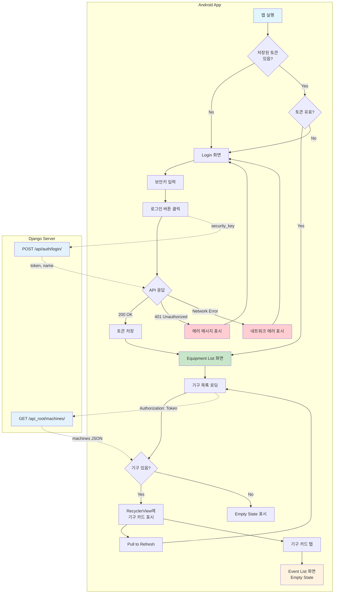

# Epic 1: User Flow Diagram

## 사용자 동작 흐름도



## 상세 흐름 설명

### 1. 앱 시작 흐름

```
┌─────────────────────────────────────────────────────────────────┐
│                         앱 실행                                  │
└─────────────────────────────────────────────────────────────────┘
                              │
                              ▼
                    ┌─────────────────┐
                    │ 저장된 토큰 확인 │
                    │ (SharedPrefs)   │
                    └─────────────────┘
                              │
              ┌───────────────┴───────────────┐
              │                               │
              ▼                               ▼
      ┌──────────────┐               ┌──────────────┐
      │  토큰 없음   │               │  토큰 있음   │
      │              │               │              │
      │ → Login 화면 │               │ → 토큰 검증  │
      └──────────────┘               └──────────────┘
                                              │
                                    ┌─────────┴─────────┐
                                    │                   │
                                    ▼                   ▼
                            ┌────────────┐      ┌────────────┐
                            │   유효     │      │   만료     │
                            │            │      │            │
                            │ → 기구목록 │      │ → Login    │
                            └────────────┘      └────────────┘
```

### 2. 로그인 흐름

```
┌─────────────────────────────────────────────────────────────────┐
│                       Login 화면                                 │
│  ┌─────────────────────────────────────────────────────────┐   │
│  │  Security Key: [________________________]               │   │
│  │                                                         │   │
│  │              [ 로그인 ]                                 │   │
│  └─────────────────────────────────────────────────────────┘   │
└─────────────────────────────────────────────────────────────────┘
                              │
                              │ 클릭
                              ▼
              ┌───────────────────────────────┐
              │  POST /api/auth/login/        │
              │  {"security_key": "..."}      │
              └───────────────────────────────┘
                              │
          ┌───────────────────┼───────────────────┐
          │                   │                   │
          ▼                   ▼                   ▼
   ┌─────────────┐    ┌─────────────┐    ┌─────────────┐
   │  200 OK     │    │    401      │    │   Error     │
   │             │    │ Unauthorized│    │   Network   │
   │ token 반환  │    │             │    │             │
   └─────────────┘    └─────────────┘    └─────────────┘
          │                   │                   │
          ▼                   ▼                   ▼
   ┌─────────────┐    ┌─────────────┐    ┌─────────────┐
   │ 토큰 저장   │    │ "잘못된     │    │ "네트워크   │
   │ (암호화)    │    │  보안키"    │    │  오류"      │
   │             │    │  Toast      │    │  Toast      │
   │ → 기구목록  │    │             │    │             │
   └─────────────┘    └─────────────┘    └─────────────┘
```

### 3. 기구 목록 흐름

```
┌─────────────────────────────────────────────────────────────────┐
│                    Equipment List 화면                           │
│  ┌─────────────────────────────────────────────────────────┐   │
│  │  ↓ Pull to Refresh                                      │   │
│  ├─────────────────────────────────────────────────────────┤   │
│  │  ┌─────────────────────────────────────────────────┐   │   │
│  │  │ [IMG] 런닝머신 #1                           >   │   │   │
│  │  │       1층 A구역  │  이벤트: 152개               │   │   │
│  │  └─────────────────────────────────────────────────┘   │   │
│  │  ┌─────────────────────────────────────────────────┐   │   │
│  │  │ [IMG] 벤치프레스 #1                         >   │   │   │
│  │  │       1층 B구역  │  이벤트: 89개                │   │   │
│  │  └─────────────────────────────────────────────────┘   │   │
│  │  ┌─────────────────────────────────────────────────┐   │   │
│  │  │ [IMG] 스쿼트랙 #1                           >   │   │   │
│  │  │       2층 A구역  │  이벤트: 45개                │   │   │
│  │  └─────────────────────────────────────────────────┘   │   │
│  └─────────────────────────────────────────────────────────┘   │
└─────────────────────────────────────────────────────────────────┘
                              │
                              │ 카드 탭
                              ▼
┌─────────────────────────────────────────────────────────────────┐
│                    Event List 화면 (Epic 2)                      │
│  ┌─────────────────────────────────────────────────────────┐   │
│  │                                                         │   │
│  │         아직 이벤트가 없습니다.                         │   │
│  │                                                         │   │
│  │    감지가 시작되면 이벤트가 표시됩니다.                 │   │
│  │                                                         │   │
│  └─────────────────────────────────────────────────────────┘   │
└─────────────────────────────────────────────────────────────────┘
```

### 4. 전체 시스템 아키텍처

```
┌─────────────────┐     ┌─────────────────┐     ┌─────────────────┐
│   Android App   │     │  Django Server  │     │   SQLite DB     │
│                 │     │  (PythonAnywhere)│     │                 │
└────────┬────────┘     └────────┬────────┘     └────────┬────────┘
         │                       │                       │
         │  POST /api/auth/login/│                       │
         │  {security_key}       │                       │
         │──────────────────────>│  SELECT * FROM       │
         │                       │  api_user WHERE      │
         │                       │  security_key = ?    │
         │                       │──────────────────────>│
         │                       │<──────────────────────│
         │                       │                       │
         │  {token, name}        │                       │
         │<──────────────────────│                       │
         │                       │                       │
         │  GET /api_root/machines/                      │
         │  Authorization: Token │                       │
         │──────────────────────>│  SELECT * FROM       │
         │                       │  gym_machine         │
         │                       │──────────────────────>│
         │                       │<──────────────────────│
         │                       │                       │
         │  [{machines}]         │                       │
         │<──────────────────────│                       │
         │                       │                       │
```

## API 엔드포인트 요약

| Step | Endpoint | Method | Request | Response |
|------|----------|--------|---------|----------|
| 로그인 | `/api/auth/login/` | POST | `{security_key}` | `{token, name}` |
| 기구 목록 | `/api_root/machines/` | GET | Header: `Authorization: Token xxx` | `[{machines}]` |

## 화면 전환 요약

```
SplashActivity
      │
      ├─[토큰 없음]──> LoginActivity
      │                    │
      │                    ├─[로그인 성공]─┐
      │                    │              │
      │                    └─[로그인 실패]─> (유지)
      │                                   │
      └─[토큰 있음/유효]─────────────────>│
                                          │
                                          ▼
                               MachineListActivity
                                          │
                                          │ [기구 탭]
                                          ▼
                               EventListActivity
                               (Empty State - Epic 2)
```
