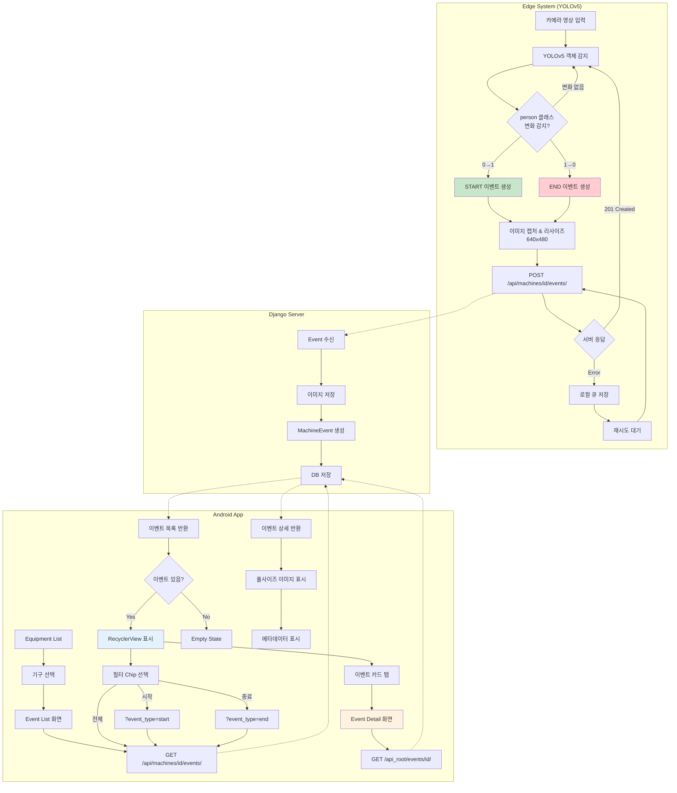

# Epic 2: User Flow Diagram

## 사용자 동작 흐름도



## 상세 흐름 설명

### 1. Edge System 흐름 (Change Detection)

```
┌─────────────────────────────────────────────────────────────────────────────┐
│                         Edge System (YOLOv5)                                 │
└─────────────────────────────────────────────────────────────────────────────┘
                                    │
                          ┌─────────▼─────────┐
                          │   카메라 영상 입력  │
                          │   (Webcam/RTSP)   │
                          └─────────┬─────────┘
                                    │
                          ┌─────────▼─────────┐
                          │  YOLOv5 객체 감지  │
                          │  (pretrained)     │
                          └─────────┬─────────┘
                                    │
                          ┌─────────▼─────────┐
                          │  person 클래스    │
                          │  카운트 추출      │
                          └─────────┬─────────┘
                                    │
              ┌─────────────────────┼─────────────────────┐
              │                     │                     │
              ▼                     ▼                     ▼
    ┌─────────────────┐   ┌─────────────────┐   ┌─────────────────┐
    │    0 → 1 이상    │   │    1 이상 → 0    │   │    변화 없음     │
    │                 │   │                 │   │                 │
    │  START 이벤트   │   │   END 이벤트    │   │   API 호출 X    │
    │  (사용 시작)    │   │   (사용 종료)   │   │   (다음 프레임)  │
    └────────┬────────┘   └────────┬────────┘   └─────────────────┘
             │                     │
             └──────────┬──────────┘
                        │
              ┌─────────▼─────────┐
              │  이미지 캡처      │
              │  640x480 리사이즈 │
              └─────────┬─────────┘
                        │
              ┌─────────▼─────────┐
              │  change_info 생성 │
              │  {                │
              │    event_type,    │
              │    prev_count,    │
              │    curr_count,    │
              │    timestamp      │
              │  }                │
              └─────────┬─────────┘
                        │
              ┌─────────▼─────────┐
              │ POST /api/machines│
              │ /{id}/events/     │
              │                   │
              │ - image           │
              │ - event_type      │
              │ - captured_at     │
              │ - person_count    │
              │ - detections      │
              │ - change_info     │
              └─────────┬─────────┘
                        │
          ┌─────────────┼─────────────┐
          │             │             │
          ▼             ▼             ▼
   ┌───────────┐ ┌───────────┐ ┌───────────┐
   │ 201 OK    │ │ 401 Auth  │ │ Network   │
   │           │ │ Error     │ │ Error     │
   │ 완료      │ │ 재인증    │ │ 로컬 저장 │
   └───────────┘ └───────────┘ └─────┬─────┘
                                     │
                               ┌─────▼─────┐
                               │ 재시도    │
                               │ 큐 대기   │
                               └───────────┘
```

### 2. Android Event List 흐름

```
┌─────────────────────────────────────────────────────────────────────────────┐
│                         Event List 화면                                      │
│  ┌─────────────────────────────────────────────────────────────────────┐   │
│  │  런닝머신 #1                                              [통계]   │   │
│  ├─────────────────────────────────────────────────────────────────────┤   │
│  │  필터: [전체] [시작] [종료]        [2024-01-01 ~ 2024-01-15]       │   │
│  ├─────────────────────────────────────────────────────────────────────┤   │
│  │  ↓ Pull to Refresh                                                 │   │
│  │  ┌───────────────────────────────────────────────────────────────┐ │   │
│  │  │ [IMG] ┌──────┐ 사용 시작                               >     │ │   │
│  │  │       │START │ 2024-01-15 10:30:00                           │ │   │
│  │  │       └──────┘ 감지 인원: 1명                                │ │   │
│  │  └───────────────────────────────────────────────────────────────┘ │   │
│  │  ┌───────────────────────────────────────────────────────────────┐ │   │
│  │  │ [IMG] ┌──────┐ 사용 종료                               >     │ │   │
│  │  │       │ END  │ 2024-01-15 10:45:00                           │ │   │
│  │  │       └──────┘ 감지 인원: 0명                                │ │   │
│  │  └───────────────────────────────────────────────────────────────┘ │   │
│  │  ┌───────────────────────────────────────────────────────────────┐ │   │
│  │  │ [IMG] ┌──────┐ 사용 시작                               >     │ │   │
│  │  │       │START │ 2024-01-15 11:00:00                           │ │   │
│  │  │       └──────┘ 감지 인원: 1명                                │ │   │
│  │  └───────────────────────────────────────────────────────────────┘ │   │
│  │                                                                     │   │
│  │  [더 보기...] (페이지네이션)                                       │   │
│  └─────────────────────────────────────────────────────────────────────┘   │
└─────────────────────────────────────────────────────────────────────────────┘
                                    │
                                    │ 이벤트 카드 탭
                                    ▼
┌─────────────────────────────────────────────────────────────────────────────┐
│                         Event Detail 화면                                    │
│  ┌─────────────────────────────────────────────────────────────────────┐   │
│  │  ← 뒤로                                                             │   │
│  ├─────────────────────────────────────────────────────────────────────┤   │
│  │                                                                     │   │
│  │  ┌───────────────────────────────────────────────────────────────┐ │   │
│  │  │                                                               │ │   │
│  │  │                    [풀사이즈 이미지]                          │ │   │
│  │  │                      640 x 480                                │ │   │
│  │  │                                                               │ │   │
│  │  └───────────────────────────────────────────────────────────────┘ │   │
│  │                                                                     │   │
│  │  이벤트 타입: ┌──────┐                                             │   │
│  │              │START │ 사용 시작                                    │   │
│  │              └──────┘                                              │   │
│  │                                                                     │   │
│  │  캡처 시간:   2024-01-15 10:30:00                                  │   │
│  │  생성 시간:   2024-01-15 10:30:02                                  │   │
│  │  감지 인원:   1명                                                  │   │
│  │                                                                     │   │
│  │  ─────────────────────────────────────────────────                 │   │
│  │  변화 정보:                                                        │   │
│  │    이전 인원: 0명                                                  │   │
│  │    현재 인원: 1명                                                  │   │
│  │    대상 클래스: person                                             │   │
│  │                                                                     │   │
│  └─────────────────────────────────────────────────────────────────────┘   │
└─────────────────────────────────────────────────────────────────────────────┘
```

### 3. 필터링 흐름

```
┌──────────────────────────────────────────────────────────────┐
│                      필터 동작 흐름                           │
└──────────────────────────────────────────────────────────────┘

[전체] 선택                    [시작] 선택                    [종료] 선택
    │                              │                              │
    ▼                              ▼                              ▼
GET /api/machines/1/        GET /api/machines/1/        GET /api/machines/1/
    events/                     events/                     events/
                               ?event_type=start           ?event_type=end
    │                              │                              │
    ▼                              ▼                              ▼
┌──────────┐                ┌──────────┐                ┌──────────┐
│ START    │                │ START    │                │ END      │
│ END      │                │ START    │                │ END      │
│ START    │                │ START    │                │ END      │
│ END      │                └──────────┘                └──────────┘
└──────────┘

[날짜 범위] 선택
    │
    ▼
┌────────────────────────┐
│ DateRangePicker        │
│ From: [2024-01-10]     │
│ To:   [2024-01-15]     │
│        [적용] [취소]   │
└────────────────────────┘
    │
    ▼
GET /api/machines/1/events/
    ?date_from=2024-01-10
    &date_to=2024-01-15
```

### 4. 전체 시스템 시퀀스

```
┌─────────┐          ┌─────────┐          ┌─────────┐          ┌─────────┐
│  Edge   │          │ Server  │          │   DB    │          │ Android │
└────┬────┘          └────┬────┘          └────┬────┘          └────┬────┘
     │                    │                    │                    │
     │  YOLOv5 감지       │                    │                    │
     │  person 0→1        │                    │                    │
     │                    │                    │                    │
     │  POST /events/     │                    │                    │
     │  {start event}     │                    │                    │
     │───────────────────>│                    │                    │
     │                    │  INSERT INTO       │                    │
     │                    │  machine_event     │                    │
     │                    │───────────────────>│                    │
     │                    │<───────────────────│                    │
     │  201 Created       │                    │                    │
     │<───────────────────│                    │                    │
     │                    │                    │                    │
     │  (시간 경과...)    │                    │                    │
     │                    │                    │                    │
     │  person 1→0        │                    │                    │
     │                    │                    │                    │
     │  POST /events/     │                    │                    │
     │  {end event}       │                    │                    │
     │───────────────────>│                    │                    │
     │                    │  INSERT INTO       │                    │
     │                    │  machine_event     │                    │
     │                    │───────────────────>│                    │
     │                    │<───────────────────│                    │
     │  201 Created       │                    │                    │
     │<───────────────────│                    │                    │
     │                    │                    │                    │
     │                    │                    │  GET /events/      │
     │                    │                    │<────────────────────│
     │                    │  SELECT * FROM     │                    │
     │                    │  machine_event     │                    │
     │                    │───────────────────>│                    │
     │                    │<───────────────────│                    │
     │                    │                    │  [{events}]        │
     │                    │                    │────────────────────>│
     │                    │                    │                    │
     │                    │                    │                    │
     │                    │                    │  GET /events/1/    │
     │                    │                    │<────────────────────│
     │                    │  SELECT * FROM     │                    │
     │                    │  machine_event     │                    │
     │                    │  WHERE id=1        │                    │
     │                    │───────────────────>│                    │
     │                    │<───────────────────│                    │
     │                    │                    │  {event detail}    │
     │                    │                    │────────────────────>│
     │                    │                    │                    │
```

## API 엔드포인트 요약

| Step | Endpoint | Method | Request | Response |
|------|----------|--------|---------|----------|
| 이벤트 생성 | `/api/machines/{id}/events/` | POST | multipart/form-data | `{event}` |
| 이벤트 목록 | `/api/machines/{id}/events/` | GET | `?event_type`, `?date_from`, `?date_to` | `[{events}]` |
| 이벤트 상세 | `/api_root/events/{id}/` | GET | - | `{event detail}` |

## 화면 전환 요약

```
MachineListActivity (Epic 1)
         │
         │ [기구 카드 탭]
         ▼
EventListActivity
         │
         ├─[필터 변경]────> (자체 갱신)
         │
         │ [이벤트 카드 탭]
         ▼
EventDetailActivity
         │
         │ [뒤로]
         ▼
EventListActivity
```
