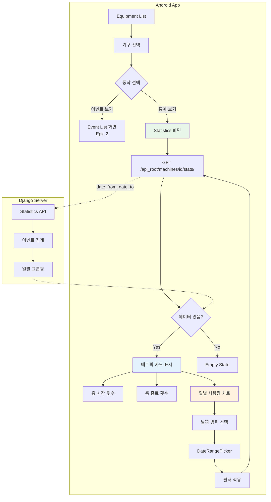

# Epic 3: User Flow Diagram

## 사용자 동작 흐름도



## 상세 흐름 설명

### 1. Statistics 화면 진입 흐름

```
┌─────────────────────────────────────────────────────────────────────────────┐
│                       Equipment List 화면                                    │
│  ┌─────────────────────────────────────────────────────────────────────┐   │
│  │ [IMG] 런닝머신 #1                                               >  │   │
│  │       1층 A구역  │  이벤트: 152개                                  │   │
│  └─────────────────────────────────────────────────────────────────────┘   │
└─────────────────────────────────────────────────────────────────────────────┘
                                    │
                                    │ 기구 선택
                                    ▼
                    ┌───────────────────────────────┐
                    │        동작 선택 메뉴         │
                    │  ┌─────────────────────────┐  │
                    │  │    📋 이벤트 목록       │  │
                    │  ├─────────────────────────┤  │
                    │  │    📊 사용 통계         │  │
                    │  └─────────────────────────┘  │
                    └───────────────────────────────┘
                                    │
                                    │ "사용 통계" 선택
                                    ▼
┌─────────────────────────────────────────────────────────────────────────────┐
│                         Statistics 화면                                      │
│  ┌─────────────────────────────────────────────────────────────────────┐   │
│  │  ← 런닝머신 #1 통계                                                 │   │
│  ├─────────────────────────────────────────────────────────────────────┤   │
│  │                                                                     │   │
│  │  ┌─────────────────────┐  ┌─────────────────────┐                  │   │
│  │  │   총 사용 시작      │  │   총 사용 종료      │                  │   │
│  │  │                     │  │                     │                  │   │
│  │  │      152회          │  │      150회          │                  │   │
│  │  │   ▲ +12 (이번 주)   │  │   ▲ +10 (이번 주)   │                  │   │
│  │  └─────────────────────┘  └─────────────────────┘                  │   │
│  │                                                                     │   │
│  │  ─────────────────────────────────────────────────                 │   │
│  │                                                                     │   │
│  │  일별 사용량                     [📅 2024-01-01 ~ 01-15]          │   │
│  │  ┌───────────────────────────────────────────────────────────────┐ │   │
│  │  │  20 │                    ▓▓▓                                  │ │   │
│  │  │     │              ▓▓▓  ▓▓▓                                  │ │   │
│  │  │  15 │        ▓▓▓  ▓▓▓  ▓▓▓  ▓▓▓                              │ │   │
│  │  │     │  ▓▓▓  ▓▓▓  ▓▓▓  ▓▓▓  ▓▓▓  ▓▓▓                          │ │   │
│  │  │  10 │  ▓▓▓  ▓▓▓  ▓▓▓  ▓▓▓  ▓▓▓  ▓▓▓  ▓▓▓                      │ │   │
│  │  │     │  ▓▓▓  ▓▓▓  ▓▓▓  ▓▓▓  ▓▓▓  ▓▓▓  ▓▓▓  ▓▓▓                  │ │   │
│  │  │   5 │  ▓▓▓  ▓▓▓  ▓▓▓  ▓▓▓  ▓▓▓  ▓▓▓  ▓▓▓  ▓▓▓                  │ │   │
│  │  │     │  ▓▓▓  ▓▓▓  ▓▓▓  ▓▓▓  ▓▓▓  ▓▓▓  ▓▓▓  ▓▓▓                  │ │   │
│  │  │   0 └──────────────────────────────────────────────────────── │ │   │
│  │  │       01   03   05   07   09   11   13   15                   │ │   │
│  │  └───────────────────────────────────────────────────────────────┘ │   │
│  │                                                                     │   │
│  └─────────────────────────────────────────────────────────────────────┘   │
└─────────────────────────────────────────────────────────────────────────────┘
```

### 2. 날짜 범위 필터링 흐름

```
┌──────────────────────────────────────────────────────────────┐
│                    날짜 범위 선택 흐름                        │
└──────────────────────────────────────────────────────────────┘

[📅 날짜 범위 버튼] 클릭
         │
         ▼
┌─────────────────────────────────────┐
│        DateRangePicker 다이얼로그   │
│  ┌─────────────────────────────────┐│
│  │     2024년 1월                  ││
│  │  일  월  화  수  목  금  토     ││
│  │       1   2   3   4   5   6     ││
│  │   7   8   9  [10] 11  12  13    ││  ← 시작일 선택
│  │  14 [15] 16  17  18  19  20    ││  ← 종료일 선택
│  │  21  22  23  24  25  26  27    ││
│  │  28  29  30  31                ││
│  └─────────────────────────────────┘│
│                                     │
│  선택: 2024-01-10 ~ 2024-01-15      │
│                                     │
│        [취소]        [적용]         │
└─────────────────────────────────────┘
         │
         │ [적용] 클릭
         ▼
GET /api_root/machines/1/stats/
    ?date_from=2024-01-10
    &date_to=2024-01-15
         │
         ▼
┌─────────────────────────────────────┐
│  API 응답                           │
│  {                                  │
│    "machine_id": 1,                 │
│    "total_starts": 45,              │  ← 필터된 기간 합계
│    "total_ends": 43,                │
│    "daily_usage": [                 │
│      {"date": "2024-01-10", "count": 8},
│      {"date": "2024-01-11", "count": 7},
│      {"date": "2024-01-12", "count": 6},
│      {"date": "2024-01-13", "count": 9},
│      {"date": "2024-01-14", "count": 7},
│      {"date": "2024-01-15", "count": 8}
│    ]                                │
│  }                                  │
└─────────────────────────────────────┘
         │
         ▼
┌─────────────────────────────────────┐
│  UI 업데이트                        │
│  - 메트릭 카드: 45회, 43회          │
│  - 차트: 6일간 데이터 표시          │
└─────────────────────────────────────┘
```

### 3. Empty State 처리

```
┌──────────────────────────────────────────────────────────────┐
│                    Empty State 흐름                          │
└──────────────────────────────────────────────────────────────┘

[데이터 없는 기간 선택]
예: 2099-01-01 ~ 2099-01-31
         │
         ▼
GET /api_root/machines/1/stats/
    ?date_from=2099-01-01
    &date_to=2099-01-31
         │
         ▼
┌─────────────────────────────────────┐
│  API 응답                           │
│  {                                  │
│    "machine_id": 1,                 │
│    "total_starts": 0,               │
│    "total_ends": 0,                 │
│    "daily_usage": []                │  ← 빈 배열
│  }                                  │
└─────────────────────────────────────┘
         │
         ▼
┌─────────────────────────────────────────────────────────────────────────────┐
│                         Statistics 화면 (Empty State)                        │
│  ┌─────────────────────────────────────────────────────────────────────┐   │
│  │  ← 런닝머신 #1 통계                                                 │   │
│  ├─────────────────────────────────────────────────────────────────────┤   │
│  │                                                                     │   │
│  │  ┌─────────────────────┐  ┌─────────────────────┐                  │   │
│  │  │   총 사용 시작      │  │   총 사용 종료      │                  │   │
│  │  │                     │  │                     │                  │   │
│  │  │       0회           │  │       0회           │                  │   │
│  │  └─────────────────────┘  └─────────────────────┘                  │   │
│  │                                                                     │   │
│  │  ─────────────────────────────────────────────────                 │   │
│  │                                                                     │   │
│  │  일별 사용량                     [📅 2099-01-01 ~ 01-31]          │   │
│  │  ┌───────────────────────────────────────────────────────────────┐ │   │
│  │  │                                                               │ │   │
│  │  │                                                               │ │   │
│  │  │                    📊                                         │ │   │
│  │  │                                                               │ │   │
│  │  │           해당 기간에 데이터가 없습니다.                      │ │   │
│  │  │                                                               │ │   │
│  │  │           다른 날짜 범위를 선택해 주세요.                     │ │   │
│  │  │                                                               │ │   │
│  │  │                                                               │ │   │
│  │  └───────────────────────────────────────────────────────────────┘ │   │
│  │                                                                     │   │
│  └─────────────────────────────────────────────────────────────────────┘   │
└─────────────────────────────────────────────────────────────────────────────┘
```

### 4. 전체 시스템 시퀀스

```
┌─────────┐                    ┌─────────┐                    ┌─────────┐
│ Android │                    │ Server  │                    │   DB    │
└────┬────┘                    └────┬────┘                    └────┬────┘
     │                              │                              │
     │  Statistics 화면 진입        │                              │
     │                              │                              │
     │  GET /api_root/machines/1/stats/                            │
     │─────────────────────────────>│                              │
     │                              │                              │
     │                              │  SELECT event_type,          │
     │                              │         COUNT(*),            │
     │                              │         DATE(captured_at)    │
     │                              │  FROM machine_event          │
     │                              │  WHERE machine_id = 1        │
     │                              │  GROUP BY event_type,        │
     │                              │           DATE(captured_at)  │
     │                              │─────────────────────────────>│
     │                              │<─────────────────────────────│
     │                              │                              │
     │  {                           │                              │
     │    total_starts: 152,        │                              │
     │    total_ends: 150,          │                              │
     │    daily_usage: [...]        │                              │
     │  }                           │                              │
     │<─────────────────────────────│                              │
     │                              │                              │
     │  메트릭 카드 + 차트 렌더링   │                              │
     │                              │                              │
     │  (날짜 범위 선택)            │                              │
     │                              │                              │
     │  GET /api_root/machines/1/stats/                            │
     │      ?date_from=2024-01-10                                  │
     │      &date_to=2024-01-15                                    │
     │─────────────────────────────>│                              │
     │                              │                              │
     │                              │  SELECT ... WHERE            │
     │                              │  captured_at BETWEEN         │
     │                              │  '2024-01-10' AND            │
     │                              │  '2024-01-15'                │
     │                              │─────────────────────────────>│
     │                              │<─────────────────────────────│
     │                              │                              │
     │  {filtered stats}            │                              │
     │<─────────────────────────────│                              │
     │                              │                              │
     │  차트 업데이트               │                              │
     │                              │                              │
```

### 5. 데이터 집계 로직

```
┌──────────────────────────────────────────────────────────────┐
│                    서버 측 집계 로직                          │
└──────────────────────────────────────────────────────────────┘

MachineEvent 테이블
┌────┬────────────┬────────────┬─────────────────────┐
│ ID │ machine_id │ event_type │     captured_at     │
├────┼────────────┼────────────┼─────────────────────┤
│  1 │     1      │   start    │ 2024-01-13 09:00:00 │
│  2 │     1      │   end      │ 2024-01-13 09:30:00 │
│  3 │     1      │   start    │ 2024-01-13 10:00:00 │
│  4 │     1      │   end      │ 2024-01-13 10:45:00 │
│  5 │     1      │   start    │ 2024-01-14 08:00:00 │
│  6 │     1      │   end      │ 2024-01-14 08:30:00 │
│ ...│    ...     │    ...     │        ...          │
└────┴────────────┴────────────┴─────────────────────┘
                    │
                    ▼
         ┌──────────────────────┐
         │  Django ORM 쿼리     │
         │                      │
         │  events.filter(      │
         │    event_type='start'│
         │  ).annotate(         │
         │    date=TruncDate()  │
         │  ).values('date')    │
         │  .annotate(          │
         │    count=Count('id') │
         │  )                   │
         └──────────────────────┘
                    │
                    ▼
┌────────────────────────────────────────────────────┐
│  집계 결과                                         │
│  ┌──────────────┬───────┐                         │
│  │    date      │ count │                         │
│  ├──────────────┼───────┤                         │
│  │ 2024-01-13   │   2   │  (start 2회)           │
│  │ 2024-01-14   │   1   │  (start 1회)           │
│  │ 2024-01-15   │   3   │  (start 3회)           │
│  └──────────────┴───────┘                         │
└────────────────────────────────────────────────────┘
                    │
                    ▼
┌────────────────────────────────────────────────────┐
│  API 응답 형식                                     │
│  {                                                 │
│    "machine_id": 1,                                │
│    "machine_name": "런닝머신 #1",                  │
│    "total_starts": 152,                            │
│    "total_ends": 150,                              │
│    "daily_usage": [                                │
│      {"date": "2024-01-13", "count": 2},          │
│      {"date": "2024-01-14", "count": 1},          │
│      {"date": "2024-01-15", "count": 3}           │
│    ]                                               │
│  }                                                 │
└────────────────────────────────────────────────────┘
```

## API 엔드포인트 요약

| Step | Endpoint | Method | Query Params | Response |
|------|----------|--------|--------------|----------|
| 통계 조회 | `/api_root/machines/{id}/stats/` | GET | `date_from`, `date_to` | `{stats}` |

## 화면 전환 요약

```
MachineListActivity (Epic 1)
         │
         │ [기구 선택] → [통계 보기]
         ▼
StatsActivity
         │
         ├─[날짜 범위 변경]────> (자체 갱신)
         │
         │ [뒤로]
         ▼
MachineListActivity
```

## 차트 컴포넌트 구조

```
┌─────────────────────────────────────────────────────────────────┐
│                   MPAndroidChart 구조                            │
└─────────────────────────────────────────────────────────────────┘

StatsActivity
    │
    ├── CardView (총 시작 횟수)
    │   └── TextView
    │
    ├── CardView (총 종료 횟수)
    │   └── TextView
    │
    └── BarChart (일별 사용량)
        ├── XAxis (날짜)
        ├── YAxis (횟수)
        ├── BarDataSet (데이터)
        └── Legend (범례)

데이터 바인딩:
daily_usage.forEach { item ->
    entries.add(BarEntry(index, item.count))
    xLabels.add(item.date)
}
```
